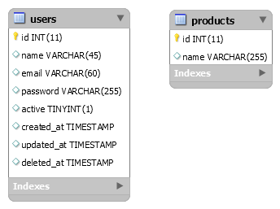

# Teste para candidatos à vaga de Desenvolvedor PHP

Olá, nesse teste analisaremos seu conhecimento geral e inclusive velocidade de desenvolvimento. Abaixo explicaremos tudo o que será necessário.

## Instruções

O desafio consiste em implementar uma aplicação Web utilizando PHP nativo ou frameworks (Laravel, CodeIgniter), e um banco de dados relacional SQLite ou MySQL, a partir de uma modelagem de dados inicial.

Você vai criar uma aplicação de cadastro de usuários e produtos, a partir de uma modelagem inicial, com as seguintes funcionalidades:

- CRUD de usuários.
- CRUD de produtos.
- Cada CRUD:
  - deve possuir paginação de 20 itens.
  - deve possuir formulários para criação e atualização de seus itens.
  - deve permitir a deleção de qualquer item de sua lista.
- Barra de navegação entre os CRUDs.

## Modelo de dados

A modelagem inicial para a implementação da solução é a seguinte:

Altere esta modelagem conforme achar necessário.

O CRUD deve conter:

- Usuários (Nome, E-mail, Senha).
- Produtos (Nome do produto, slug do produto, descrição e foto do produto).

## Tecnologias a serem utilizadas

Devem ser utilizadas as seguintes tecnologias:

- HTML
- CSS
- Javascript
- PHP nativo ou frameworks (Laravel, CodeIgniter)

## Entrega

- Coloque o seu código em um repositório privado no GitHub, compartilhe com o usuário @altacomunicazione e nos avise por e-mail.
- Não se esqueça de documentar o passo a passo para rodar o seu projeto.

## Bônus

- Implementar autenticação de usuário na aplicação.
- Permitir que o usuário mude o número de itens por página.
- Implementar a camada de Front-End utilizando a biblioteca Bootstrap e ser responsiva.

## O que iremos analisar

- Organização do código;
- Separação de módulos e componentes;
- Legibilidade;

### Boa sorte!